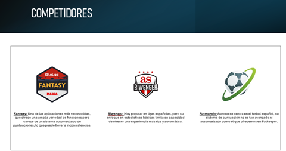
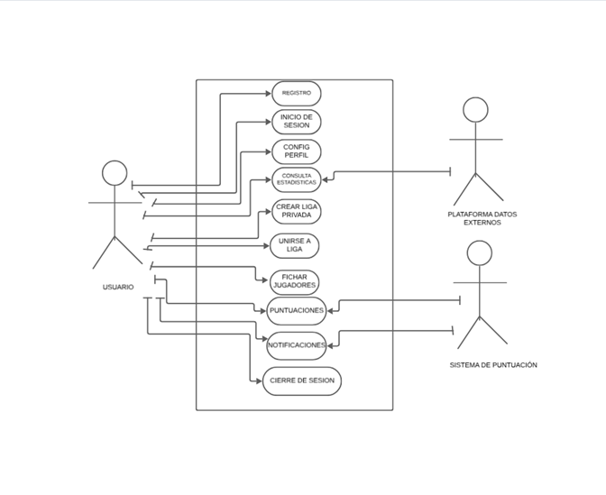

# Aplicación de la Normativa APA en el Proyecto Intermodular DAM1 VRT - BBDD

**Autor:** Lucas Blanco Álvarez
**Ubicación:** Oviedo (Asturias)
**Curso:** PROYECTO INTERMODULAR DAM1 VRT – BBDD · IES Juan José Calvo Miguel (Sotrondio)
**Profesorado:** Julia Triana
**Fecha:** 17 de febrero de 2025

---

## Índice

* [Resumen](#resumen)

  * [1.1 Descripción breve](#11-descripción-breve)
  * [1.2 Objetivo general](#12-objetivo-general)
* [Motivación](#motivación)

  * [2.1 Creciente popularidad](#21-creciente-popularidad)
  * [2.2 Problemas identificados](#22-problemas-identificados)
  * [2.3 Oportunidad](#23-oportunidad)
* [Apéndice A. Descripción de la aplicación Futkeeper](#apéndice-a-descripción-de-la-aplicación-futkeeper)
* [Figura 1. Comparativa de competidores](#figura-1-comparativa-de-competidores)
* [Competidores](#competidores)
* [Tabla 1. Ejemplo de sistema de puntuación](#tabla-1-ejemplo-de-sistema-de-puntuación)
* [Casos de uso: Identificación, definición y diagramas](#casos-de-uso-identificación-definición-y-diagramas)

  * [1. Identificación de casos de uso](#11-identificación-de-casos-de-uso)
  * [2. Definición de casos de uso](#12-definición-de-casos-de-uso)
* [Diagrama de uso Futkeeper](#diagrama-de-uso-futkeeper)
* [Referencias (formato APA 7ª ed.)](#referencias-formato-apa-7ª-ed)

---

## Resumen

### 1.1 Descripción breve

**Futkeeper** es una aplicación innovadora de puntuación de futbolistas que utiliza un sistema automatizado para calcular la puntuación de los jugadores a partir de estadísticas avanzadas y datos en tiempo real. Su objetivo es ofrecer a los aficionados una experiencia fluida y competitiva, eliminando frustraciones habituales de plataformas actuales.

### 1.2 Objetivo general

Proporcionar una plataforma donde el juego sea **justo y basado en datos**, evitando limitaciones de herramientas que dependen de puntuaciones manuales y sufren problemas de estabilidad.

---

## Motivación

### 2.1 Creciente popularidad

El interés por los juegos deportivos con **puntuaciones automáticas** ha crecido de forma notable. Aumentan usuarios y ligas virtuales, haciendo más atractivas propuestas como Futkeeper.

### 2.2 Problemas identificados

Muchas plataformas presentan:

* **Caídas** en picos de demanda.
* **Puntuación manual** y, por tanto, **subjetiva**.
  Esto perjudica la equidad y la experiencia de juego.

### 2.3 Oportunidad

Futkeeper resuelve estos inconvenientes con **automatización** y **estabilidad**, fomentando un entorno competitivo y justo.

---

## Apéndice A. Descripción de la aplicación Futkeeper

Futkeeper ofrece una experiencia **automática y justa**. Calcula puntuaciones en tiempo real con **métricas avanzadas** y está preparada para manejar **alto volumen de usuarios** sin pérdida de rendimiento en eventos de alta demanda.

---

## Figura 1. Comparativa de competidores

> ## Figura 1. Comparativa de competidores

> *Figura 1. Comparativa de competidores.*

---

## Competidores

1. **Fantasy**: amplia funcionalidad, pero **sin sistema automatizado** de puntuaciones (posibles inconsistencias).
2. **Biwenger**: popular en ligas españolas; su enfoque en **estadísticas básicas** limita una experiencia más rica y automática.
3. **Futmundo**: centrado en fútbol español; su sistema no es tan **avanzado ni automatizado** como el de Futkeeper.

---

## Tabla 1. Ejemplo de sistema de puntuación

| Jugador   | Entradas | Centros | Despejes | **Puntos totales** |
| --------- | :------: | :-----: | :------: | :----------------: |
| Jugador A |     5    |    3    |     4    |         12         |
| Jugador B |     4    |    4    |     5    |         13         |
| Jugador C |     6    |    2    |     3    |         11         |

*Fuente: Adaptado de «Sistema de puntuación para Futkeeper», 2025.*[^1]

La automatización de la puntuación es una de las principales ventajas de Futkeeper, garantizando una experiencia **justa** para todos los jugadores.[^1]

[^1]: El ejemplo de cálculo y su explicación provienen del documento «Sistema de puntuación para Futkeeper» (2025).

---

## Casos de uso: Identificación, definición y diagramas

### 1.1 Identificación de casos de uso

1. Registro de usuario
2. Inicio de sesión
3. Configuración de perfil
4. Consulta de estadísticas de jugadores
5. Creación de liga privada
6. Unirse a una liga
7. Selección de jugadores para el equipo
8. Visualización de puntuaciones en tiempo real
9. Notificaciones de eventos importantes
10. Cierre de sesión

### 1.2 Definición de casos de uso

#### 1) Registro de usuario

* **Actores:** Usuario
* **Acciones:**

  * Ingresar datos personales
  * Confirmar correo electrónico
  * Crear una contraseña

#### 2) Inicio de sesión

* **Actores:** Usuario
* **Acciones:**

  * Introducir credenciales
  * Validación en la base de datos
  * Acceso a la aplicación

#### 3) Configuración de perfil

* **Actores:** Usuario
* **Acciones:**

  * Modificar datos personales
  * Agregar foto de perfil
  * Guardar cambios

#### 4) Consulta de estadísticas de jugadores

* **Actores:** Usuario, Plataforma de datos externos
* **Acciones:**

  * Buscar jugadores
  * Visualizar estadísticas
  * Comparar jugadores

#### 5) Creación de liga privada

* **Actores:** Usuario
* **Acciones:**

  * Introducir nombre de la liga
  * Configurar reglas
  * Invitar a otros jugadores

#### 6) Unirse a una liga

* **Actores:** Usuario
* **Acciones:**

  * Introducir código de invitación
  * Confirmar adhesión
  * Acceder a configuración de la liga

#### 7) Selección de jugadores para el equipo

* **Actores:** Usuario
* **Acciones:**

  * Elegir jugadores disponibles
  * Confirmar alineación
  * Guardar cambios

#### 8) Visualización de puntuaciones en tiempo real

* **Actores:** Usuario, Sistema de puntuación
* **Acciones:**

  * Consultar puntuaciones
  * Filtrar por jugadores o ligas
  * Comparar rendimiento

#### 9) Notificaciones de eventos importantes

* **Actores:** Usuario, Sistema de puntuación
* **Acciones:**

  * Recibir alertas de rendimiento
  * Configurar notificaciones
  * Visualizar historial de eventos

#### 10) Cierre de sesión

* **Actores:** Usuario
* **Acciones:**

  * Seleccionar opción de cierre de sesión
  * Confirmar acción

---

## Diagrama de uso Futkeeper

> **Placeholder de diagrama general**
> 
> *Diagrama general de casos de uso y relaciones principales.*

---

## Referencias (formato APA, 7ª ed.)

* Carreño, L. (9 de febrero de 2020). La disputa gremial por los aranceles a las prendas de vestir. *El Espectador*. [https://www.elespectador.com/economia/la-disputa-gremial-por-los-aranceles-las-prendas-de-vestir-articulo-903768](https://www.elespectador.com/economia/la-disputa-gremial-por-los-aranceles-las-prendas-de-vestir-articulo-903768)
* Gómez, M. (12 de marzo de 2021). El impacto del cambio climático en las ciudades costeras. *El País*. [https://elpais.com/medioambiente/2021-03-12/el-impacto-del-cambio-climatico-en-las-ciudades-costas.html](https://elpais.com/medioambiente/2021-03-12/el-impacto-del-cambio-climatico-en-las-ciudades-costas.html)
* Rodríguez, F. (3 de agosto de 2019). La reforma educativa y su impacto en el sistema escolar. *La Vanguardia*. [https://www.lavanguardia.com/educacion/reforma-educativa-impacto-sistema-escolar-2019.html](https://www.lavanguardia.com/educacion/reforma-educativa-impacto-sistema-escolar-2019.html)
* Morales, S. (21 de enero de 2020). Crisis de salud pública por contaminación en las grandes ciudades. *El Universal*. [https://eluniversal.com.mx/salud/crisis-salud-publica-contaminacion-grandes-ciudades-2020](https://eluniversal.com.mx/salud/crisis-salud-publica-contaminacion-grandes-ciudades-2020)
* Fernández, R. (18 de mayo de 2021). Desafíos en el sistema de salud durante la pandemia global. *La Jornada*. [https://www.jornada.com.mx/2021/05/18/salud/desafios-sistema-pandemia-2021](https://www.jornada.com.mx/2021/05/18/salud/desafios-sistema-pandemia-2021)
* Pérez, A. (8 de noviembre de 2019). La tecnología como motor del cambio en la educación superior. *ABC*. [https://abc.es/tecnologia/educacion-superior-tecnologia-cambio-2019.html](https://abc.es/tecnologia/educacion-superior-tecnologia-cambio-2019.html)

---

> **Notas de maquetación para el repositorio**
>
> * Coloca las imágenes en `./assets/` con los nombres usados arriba o ajusta las rutas.
> * Mantén la numeración y títulos tal como están para facilitar la lectura académica y el seguimiento de la normativa APA en la sección de referencias.
> * Si generas los diagramas con una herramienta (p. ej., draw.io), exporta a PNG/SVG y reemplaza los *placeholders*.

